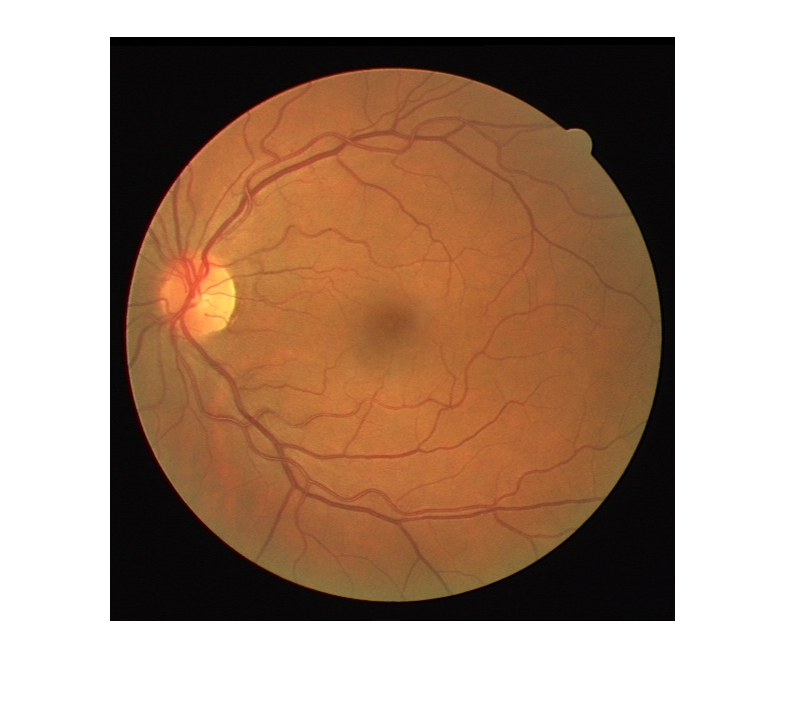
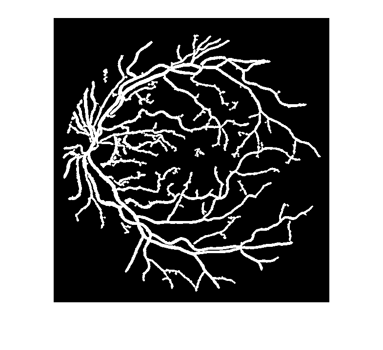

# Eye-Blood-Vessel-Extractor

This project extracts eye blood vessels from eye images in the DRIVE dataset using morphological operations. The primary method involves running an opening operation with a line structure at every 15 degrees to highlight the eye vessels. It then applies an average filter, subtracts the image from it to get the edges and vessels' edges, and finally fills the gaps and removes the noise.

## Methodology

The extraction process involves several steps:

1. **Image Preprocessing**:
   - Load the image and mask from the DRIVE dataset.
   - Extract the green channel as it shows blood vessels more clearly.
   - Enhance the image brightness using adaptive histogram equalization.

2. **Morphological Operations**:
   - Use linear structuring elements at various angles to enhance linear structures (blood vessels) in the image.
   - Perform an opening operation to minimize non-linear objects and highlight linear ones.

3. **Edge Detection and Noise Removal**:
   - Apply an averaging filter to blur the image and subtract it from the enhanced image to get vessel edges.
   - Remove noise and fill gaps in the binary image.
   - Perform morphological dilation to thicken the vessels and further clean the image.

4. **Performance Evaluation**:
   - Calculate sensitivity, specificity, and accuracy against the manual annotations provided in the DRIVE dataset.

## Results

The method yields the following average performance metrics:
- **Sensitivity**: 0.8736
- **Specificity**: 0.9454
- **Accuracy**: 0.9365

## Examples

This is an input image example:

The output of this image:

